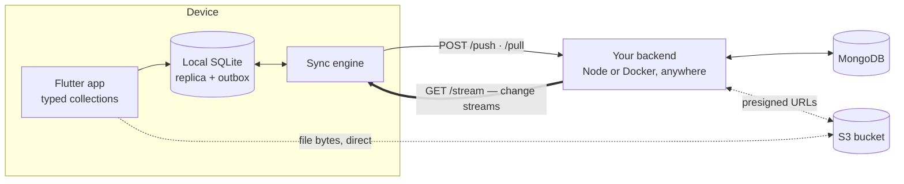

# onebase

[](https://github.com/ybenjaa-dev/onebase/actions/workflows/ci.yml)
[](https://pub.dev/packages/onebase)

**Firebase for Flutter — on your own MongoDB and S3.**

Offline-first data, realtime sync, and file storage. One package in your app,
one small server you deploy. No third-party sync service, no vendor account.

```dart
await Onebase.init(OnebaseConfig(
  apiUrl: 'https://your-backend.example.com',
  tokenProvider: TokenProvider(() async => myAuth.currentJwt),
  schema: onebaseSchema,
));

// Reactive, offline-first, typed — the model is generated for you.
Stream<List<Todo>> live = OnebaseDb.todos
    .where('done', isEqualTo: false)
    .orderBy('created_at', descending: true)
    .watch();

await OnebaseDb.todos.insert(Todo(title: 'Ship it', done: false));
await Onebase.storage.ref('avatars/me.png').putData(bytes);
```

---

## Why

MongoDB retired Realm, Atlas Device Sync and the Data API in September 2025,
leaving Flutter developers without an official offline-first path to MongoDB.
The alternatives mean either writing a backend or renting someone else's sync
service.

`onebase` is the third option: the sync engine lives in the package, and the
CLI generates the one small server that stands between your app and your
database. You own both ends.

## How it works



- **Reads** never touch the network. Queries and `watch()` run against the
  local SQLite replica — instant, and fully functional offline.
- **Writes** apply locally first and land in an outbox. Both happen in one
  transaction, so a crash can't leave a row that never uploads.
- **Sync** pushes before it pulls, so a fresh local write is never clobbered by
  a stale snapshot. Pending writes are replayed on top of each incoming
  snapshot, so optimistic UI survives until the server confirms it.
- **Realtime** is a live SSE channel fed by MongoDB change streams — changes
  arrive in milliseconds, not on a poll.
- **Files** go straight from the device to your bucket. The backend only signs
  a short-lived URL, so a large upload costs it nothing.

## Quickstart

**1. Install**

```yaml
dependencies:
  onebase: ^0.3.2    # requires Flutter 3.38+ / Dart 3.10+
```

**2. Describe your data** — `dart run onebase:setup --init` creates
`onebase.yaml`:

```yaml
collections:
  todos:
    owner_field: owner_id      # per-user isolation, enforced server-side
    fields:
      title: text!             # trailing ! = required (non-nullable in Dart)
      done: bool!
      created_at: datetime
      owner_id: text

storage:
  avatars:
    access: private            # each user only ever sees their own files
    max_size: 5MB
    content_types: [image/*]
```

Field types: `text`, `int`, `double`, `bool`, `datetime`, `json`.
`json` fields hold nested documents and are queryable with dot-paths:
`where('address.city', isEqualTo: 'Rabat')`.

**3. Generate**

```bash
dart run onebase:setup
```

| Path | What it is |
|---|---|
| `lib/onebase_schema.g.dart` | Typed models (`Todo`), typed collections (`OnebaseDb.todos`), runtime schema |
| `backend/` | Your server: Dockerfile, Vercel adapter, `.env.example` |

**4. Deploy the backend** — anywhere Node or Docker runs:

```bash
cd backend
cp .env.example .env      # MONGO_URI, MONGO_DB, AUTH_MODE
docker build -t my-backend . && docker run -p 3000:3000 --env-file .env my-backend
```

Or `npx vercel deploy --prod`, or `npm run dev` locally. Any MongoDB with a
replica set works, including a free Atlas M0.

## Pagination and infinite scroll

Cursors are keyset-based: the query seeks straight to the position instead of
counting past everything before it, so the thousandth page costs what the first
one did. Rows inserted while someone scrolls cannot make a page repeat or skip
an item.

```dart
var page = await OnebaseDb.todos.orderBy('created_at').limit(20).page();
page.items;      // List<Todo>
page.hasMore;    // is there another page
page.cursor;     // pass to startAfter for the next one
```

For a scrolling list, `pager()` keeps the bookkeeping:

```dart
final pager = OnebaseDb.todos
    .where('done', isEqualTo: false)
    .orderBy('created_at', descending: true)
    .pager(pageSize: 20);

ListView.builder(
  itemCount: pager.items.length + (pager.hasMore ? 1 : 0),
  itemBuilder: (context, index) {
    if (index >= pager.items.length) {
      pager.loadMore();          // safe to call on every frame
      return const CircularProgressIndicator();
    }
    return TodoTile(pager.items[index]);
  },
);
```

`loadMore()` ignores overlapping calls, so a scroll listener firing three times
in one frame still loads one page. Listen to `pager.changes` to rebuild, and
`refresh()` for pull-to-refresh. Failures land on `pager.error` and leave what
is already loaded on screen.

## Controlling what syncs

Offline-first means holding data on the device, so a collection that grows
without bound would otherwise grow the device's copy with it. Each collection
decides how much it keeps:

```yaml
collections:
  todos:                   # default: everything the user can see
    owner_field: owner_id
    fields: {...}

  messages:                # only the recent slice lives on the device
    owner_field: owner_id
    sync:
      window: 90d
      field: sent_at
    fields: {...}

  audit_log:               # never downloaded; reads go to the backend
    owner_field: owner_id
    sync: none
    fields: {...}
```

| `sync` | On the device | Reads | Works offline |
|---|---|---|---|
| default | everything | local, instant | yes |
| `window: 90d` | the recent slice | local, instant | for that slice |
| `none` | nothing | paged from the backend | no |

`sync: none` is not the same as unreadable — the collection still queries and
pages normally, it just never downloads. That is what lets one app keep small
collections local and instant while paging through a million-row table
untouched. Nothing outside a window is hidden either: a direct query still
finds it.

## Teams and groups

A collection can belong to a group rather than one user. Membership comes from
a table you already keep:

```yaml
memberships:
  family:
    collection: family_members
    user_field: user_id
    group_field: family_id
    role_field: role          # optional, needed for `write: admin`

collections:
  chores:
    scope:
      membership: family
      field: family_id
      write: member           # owner | member | admin | none
    fields:
      title: text!
      family_id: text!
```

Reads, writes, sync and the realtime stream are all narrowed to the groups the
caller belongs to — enforced by the backend from the verified token, never by
the client. `write: admin` requires the membership row's role; `write: owner`
lets the group read while only the document's author writes; `write: none`
makes it read-only for clients.

The group field is immutable on update, so a document cannot be moved into a
group whose members were never allowed to see it.

## Atomic writes

```dart
final batch = await Onebase.instance.batch();
final orderId = batch.insert('orders', {'total': 42});
batch.update('inventory', stockId, {'count': 9});
await batch.commit();
```

Every operation lands inside one MongoDB transaction — all of them, or none.
Offline the whole batch is queued as a unit, so it stays atomic even if the app
is killed before it syncs. Insert returns its id immediately, so later
operations in the same batch can reference it.

## Offline or online

```dart
OnebaseConfig(
  mode: OnebaseMode.offline,   // default: local replica, works with no network
  // mode: OnebaseMode.online, // thin client: every read and write hits the backend
  realtime: true,
  realtimeCollections: {'todos'},  // optional: subscribe to part of the schema
)
```

| | `offline` (default) | `online` |
|---|---|---|
| Reads | local SQLite, instant | one round trip |
| Works with no network | yes, reads and writes | no |
| Writes | queued, retried, survive a restart | sent immediately, throw on failure |
| Storage on device | a few MB | none |

Your app code is identical in both. Switching is one line.

## Files

```dart
final ref = Onebase.storage.ref('avatars/me.png');

await ref.putData(await file.readAsBytes());
final url = await ref.getDownloadUrl();      // straight into Image.network
await ref.delete();

final mine = await Onebase.storage.bucket('avatars').list();
```

Works with anything S3-compatible: AWS S3, Cloudflare R2, MinIO, Backblaze B2,
DigitalOcean Spaces. Set `S3_BUCKET`, `S3_ACCESS_KEY_ID`,
`S3_SECRET_ACCESS_KEY` (plus `S3_ENDPOINT` for anything that isn't AWS). Leave
them unset and storage stays off.

## Group data

Some data belongs to a group rather than to one person — a family, a team, a
household. Declare where membership lives, then scope collections to it:

```yaml
memberships:
  family:
    collection: family_members   # rows saying who is in which family
    user_field: user_id
    group_field: family_id
    role_field: role             # optional — needed for `write: admin`
    admin_role: admin            # optional — defaults to "admin"

collections:
  family_members:
    scope: {membership: family, field: family_id, write: none}
    fields: {family_id: text!, user_id: text!, role: text!}

  family_cheers:
    owner_field: from_user_id
    scope: {membership: family, field: family_id, write: member}
    fields: {family_id: text!, from_user_id: text!, message: text}

  profiles:                      # I write mine, my family reads it
    owner_field: user_id
    scope: {membership: family, field: family_id, write: owner}
    fields: {user_id: text!, family_id: text, name: text}
```

`field: id` scopes a collection by its own document id — the shape the group
collection itself has, where a family's id *is* the group id.

| `write:` | Who may write |
|---|---|
| `owner` | only the `owner_field` user — the group reads, one person writes |
| `member` | any member of the group (the default) |
| `admin` | only members whose membership row carries `admin_role` |
| `none` | nobody from a client — server endpoints only |

`write: none` is how joining and leaving stay safe: a client that could write
its own membership row could add itself to any group, so those go through an
endpoint of yours that validates an invite instead.

Reads combine, they don't replace: a collection with both an `owner_field`
and a `scope` syncs *my documents plus my group's*. Every rule is enforced by
the backend — a patched client resolves the same group ids from the same
membership rows, and a member removed from a group stops receiving its data
on the next request, including on an open realtime stream.

## Auth

Bring your own JWTs — anything that issues them works:

```dart
// Supabase
TokenProvider(() async => Supabase.instance.client.auth.currentSession?.accessToken)

// Firebase
TokenProvider(() => FirebaseAuth.instance.currentUser?.getIdToken())

// Auth0
TokenProvider(() => auth0.credentialsManager.credentials().then((c) => c.accessToken))
```

The backend's `AUTH_MODE` decides how they're verified. It has **no default** —
the server refuses to start until you pick one:

| `AUTH_MODE` | Verification | `/token` endpoint | Use for |
|---|---|---|---|
| `jwks` | `JWKS_URL` + required `JWT_AUDIENCE` | disabled | production with a real auth provider |
| `hs256` | shared `JWT_SECRET` (32+ chars) | disabled | production when your own service signs tokens |
| `dev` | shared `JWT_SECRET` (32+ chars) | **enabled** | the quickstart, never real users |

`dev` mode exposes `/token`, which signs a JWT for any email address. It exists
so your first sync works in minutes.

## Security model

- **Per-user isolation is server-side.** Ownership is assigned from the
  verified JWT on insert, treated as immutable, and enforced on every read,
  update and delete. A patched client cannot reach another user's data.
- **Only declared fields are written.** Anything else in a payload is dropped
  and logged, so a client cannot set a server-managed field.
- **Writes merge, not replace.** `put` is a `$set` upsert, so fields your
  backend maintains outside the schema survive a client write.
- **Batches are atomic**, applied inside a MongoDB transaction.
- **Algorithms are pinned** — HS256 for shared secrets, asymmetric for JWKS. A
  token can't negotiate a weaker one.
- **Queries can't become arbitrary database queries.** `/query` accepts a
  closed set of operators and only fields your schema declares.
- **Group membership is resolved server-side** from the verified token.
  Belonging to no group returns nothing, never everything.
- **Requests are bounded.** Bodies are capped before parsing, a push is capped
  at 1000 operations, and each user has a per-route budget per minute.
- **File paths can't escape their prefix.** Private buckets namespace keys by
  user id; `..`, absolute paths and control characters are rejected rather than
  sanitized. The signed URL pins content type and length.
- **No database credentials ship in the app.** The client knows one URL and the
  user's JWT.

## Diagnosing a project

```bash
dart run onebase:setup --doctor --api-url https://your-backend.example.com
```

Catches the failure that actually bites: a backend deployed from an older
schema. Also checks environment configuration, unsafe `AUTH_MODE`, missing
storage credentials, and whether the backend answers. Every finding comes with
the command that fixes it.

## vs Firebase

| | Firestore | onebase |
|---|---|---|
| Reactive queries | `snapshots()` | `watch()` |
| Offline-first | cache-based | full local SQLite replica |
| Backend code | none | none written — generated by the CLI |
| Data model | proprietary | real MongoDB — use Atlas tooling, aggregation, BI |
| Per-user security | client-visible rules | server-side, from the verified JWT |
| File storage | Firebase Storage | any S3-compatible bucket |
| Self-hosting | no | yes — your database, your bucket, your container |
| Vendor services | Firebase | none beyond the ones you already pay for |

## Limitations

- **Conflicts are last-write-wins** by server timestamp. There is no custom
  merge hook yet.
- **The rate limiter is per-instance**, held in memory. Behind several
  instances the effective budget multiplies by instance count.
- **Realtime needs a long-lived connection.** Container hosts hold it fine;
  short-lived serverless functions cut it and onebase falls back to polling.
- **Uploads are not offline-queued.** Document writes survive with no network;
  file uploads need a connection and say so.
- Queries run on synced data — a device sees its user's documents, its groups'
  documents and `shared: true` collections, not the whole database.
- `shared: true` collections are readable and writable by any signed-in user.
  Use a `scope:` instead when the data belongs to a group.
- A user's groups are re-read per request. A very large group count per user
  makes that lookup the cost of a sync; it is capped at 200.
- No aggregation pipeline on-device.

## Development

```bash
flutter test                       # 197 unit and integration tests
cd tool/e2e && npm install && npm test
```

The e2e suite runs the generated backend against a real MongoDB replica set
(in-memory, no Docker required) and a stub object store: cross-user isolation,
field allowlisting, transactional batches, tombstone delivery, the pull
watermark, query injection attempts, realtime delivery, and storage path
safety. The S3 signer is pinned to AWS's published test vector.

The [example app](example/) is a complete Riverpod + hooks todo app with login,
offline banner, live indicator and realtime sync.

## License

MIT © Soft2Scale
