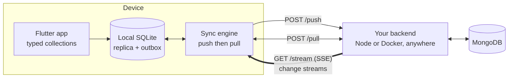

# onebase

**Firebase for Flutter, on your own MongoDB and S3.**
Offline-first data, realtime sync and file storage — one package, one tiny
backend.

MongoDB retired Realm, Atlas Device Sync and the Data API (EOL September 30,
2025), leaving Flutter developers without an official "no backend" path to
MongoDB. `onebase` fills that gap and then covers the rest of what an app
needs: a Firestore-style API over a local SQLite replica, a sync engine built
into the package, presigned file storage on any S3-compatible bucket, and a
CLI that generates the one small server in between.

One name because it is one thing: your documents, your files and your realtime
channel behind a single URL. No third-party sync service, no vendor account,
nothing to keep running except your database, your bucket and one container.

```dart
await Onebase.init(OnebaseConfig(
  apiUrl: 'https://your-backend.example.com',
  tokenProvider: TokenProvider(() async => myAuth.currentJwt),
  schema: onebaseSchema, // generated
));

// Typed collections and models are generated from your YAML — no
// hand-written model class, no converter wiring.
Stream<List<Todo>> live = OnebaseDb.todos
    .where('done', isEqualTo: false)
    .orderBy('created_at', descending: true)
    .limit(50)
    .watch();

// Offline-first writes — instant locally, synced in the background:
final id = await OnebaseDb.todos.insert(Todo(title: 'Ship it', done: false));
await OnebaseDb.todos.update(id, {'done': true});
await OnebaseDb.todos.delete(id);
```

## How it works



- **Reads** never touch the network. Queries and `watch()` streams run
  against the local SQLite replica — instant, and fully functional offline.
- **Writes** apply locally first and land in an outbox. The sync engine
  uploads them to `/push`, retrying with backoff; nothing is lost if the app
  is killed mid-flight.
- **Sync** pushes before it pulls, so a fresh local write is never clobbered
  by a stale server snapshot. Pending writes are replayed on top of each
  incoming snapshot, so optimistic UI state survives until the server
  confirms it.
- **Realtime** is a live Server-Sent Events channel fed by MongoDB change
  streams. A change reaches other devices in milliseconds, not on a poll.
  The periodic sync stays on as the safety net, so a dropped stream degrades
  to polling instead of breaking.
- **No credentials in the app.** The client knows one URL and the signed-in
  user's JWT. MongoDB is reachable only from your backend.

## File storage

Declare buckets next to your collections:

```yaml
storage:
  avatars:
    access: private          # each user only ever sees their own files
    max_size: 5MB
    content_types: [image/*]
  brochures:
    access: shared           # any signed-in user may read
```

```dart
final ref = Onebase.storage.ref('avatars/me.png');

await ref.putData(await file.readAsBytes());
final url = await ref.getDownloadUrl();   // hand straight to Image.network
await ref.delete();

final mine = await Onebase.storage.bucket('avatars').list();
```

Bytes go **straight from the device to your object store** with a short-lived
presigned URL — they never pass through your server, so a large upload costs it
nothing and works fine on serverless.

Works with anything S3-compatible: AWS S3, Cloudflare R2, MinIO, Backblaze B2,
DigitalOcean Spaces. Set `S3_BUCKET`, `S3_ACCESS_KEY_ID`,
`S3_SECRET_ACCESS_KEY` (plus `S3_ENDPOINT` for anything that isn't AWS). Leave
them unset and the storage routes report 501 — storage is opt-in.

What the backend guarantees:

- A private bucket namespaces every key by user id, so one user cannot name —
  let alone read — another user's file.
- Paths that could escape that prefix (`..`, absolute, backslashes, control
  characters) are rejected, never "cleaned up".
- The signed URL pins the content type **and** length, so the object store
  itself rejects an upload that exceeds what was approved.
- In a shared bucket anyone may read, but only the uploader may overwrite or
  delete.

Uploads need a connection — unlike document writes they are not queued for
later, because holding file bytes in the local database would bloat it.

## Offline or online — one line

```dart
OnebaseConfig(
  mode: OnebaseMode.offline,  // default: local replica, works with no network
  // mode: OnebaseMode.online, // thin client: every read and write hits the backend
  realtime: true,                // live changes in either mode
  realtimeCollections: {'todos'}, // optional: subscribe to part of the schema
)
```

| | `offline` (default) | `online` |
|---|---|---|
| Reads | local SQLite, instant | one round trip |
| Works with no network | yes, reads and writes | no |
| Writes | queued, retried, survive a restart | sent immediately, throw on failure |
| `watch()` | local change detection | realtime push, polling fallback |
| Storage on device | a few MB | none |

Your app code is identical in both. Switching is one line.

## Quickstart (~10 minutes)

**1. Install**

```yaml
dependencies:
  onebase: ^0.3.0
```

**2. Describe your data** — create `onebase.yaml`:

```bash
dart run onebase:setup --init
```

```yaml
collections:
  todos:
    owner_field: owner_id        # per-user isolation (enforced server-side)
    fields:
      title: text
      done: bool
      created_at: datetime
      owner_id: text
```

Field types: `text`, `int`, `double`, `bool`, `datetime`, `json`
(`json` fields hold nested documents/arrays and are queryable with
dot-paths: `where('address.city', isEqualTo: 'Rabat')`).

A trailing `!` marks a field **required** — non-nullable on the generated
model, and enforced by the backend on every whole-document write. Add
`model: Todo` to a collection to override the generated class name.

**3. Generate everything**

```bash
dart run onebase:setup
```

This writes:

| Path | What it is |
|---|---|
| `lib/onebase_schema.g.dart` | Typed models (`Todo`), typed collections (`OnebaseDb.todos`), and the runtime schema |
| `backend/` | Your server: five routes, a Dockerfile, and a Vercel adapter |

**4. Run the backend anywhere**

```bash
cd backend
cp .env.example .env     # MONGO_URI, MONGO_DB, AUTH_MODE
docker build -t my-backend . && docker run -p 3000:3000 --env-file .env my-backend
```

Or `npm run dev` locally, or `npx vercel deploy --prod` — the adapter is
already wired. Any MongoDB with a replica set works, including a free Atlas
M0 cluster.

**4. Initialize and build UI** — see the [example app](example/) for a
complete Todo app with login, offline banner and realtime sync.

## Auth: bring your own JWTs

`onebase` is auth-agnostic — anything that issues JWTs works:

```dart
// Supabase Auth
TokenProvider(() async =>
    Supabase.instance.client.auth.currentSession?.accessToken)

// Firebase Auth
TokenProvider(() => FirebaseAuth.instance.currentUser?.getIdToken())

// Auth0
TokenProvider(() => auth0.credentialsManager.credentials()
    .then((c) => c.accessToken))

// Dev mode: the generated backend includes a /token endpoint that signs
// HS256 JWTs for any email — zero third-party accounts to start.
```

The backend's `AUTH_MODE` decides how those tokens are verified. It has
**no default** — the server refuses to start until you pick one:

| `AUTH_MODE` | Verification | `/token` endpoint | Use for |
|---|---|---|---|
| `jwks` | `JWKS_URL` + required `JWT_AUDIENCE` | disabled | production with Supabase/Firebase/Auth0 |
| `hs256` | shared `JWT_SECRET` (32+ chars) | disabled | production when your own service signs tokens |
| `dev` | shared `JWT_SECRET` (32+ chars) | **enabled** | the quickstart, never real users |

`JWT_ISSUER` is optional in every mode; set it whenever your provider
publishes an `iss` claim.

Call `Onebase.instance.refreshToken()` after sign-in/out, and
`Onebase.instance.clearLocalData()` on sign-out so the next user can't see
cached documents.

## Typed models

```dart
final todos = Onebase.collection('todos').withConverter<Todo>(
  fromJson: Todo.fromJson,
  toJson: (todo) => todo.toJson(),
);

final Stream<List<Todo>> live = todos.where('done', isEqualTo: false).watch();
final String id = await todos.insert(Todo(title: 'Ship it'));
```

## Security model

- **Per-user isolation is server-side.** Every non-`shared` collection needs
  an `owner_field`. The generated Sync Streams filter reads with
  `WHERE owner_field = auth.user_id()` (the verified JWT `sub`), and the
  generated upload endpoint assigns ownership from the token on insert,
  refuses cross-user updates/deletes, and treats the owner field as
  immutable. A malicious client can't read or write anyone else's documents
  — even with a patched binary.
- **No database credentials ship in the app.** MongoDB is reachable only
  from your backend.
- **Every route verifies the JWT** — reads and writes alike — with pinned
  algorithms and, in `jwks` mode, a required audience.
- **Only declared fields are written.** The upload endpoint projects every
  incoming document onto the fields in `onebase.yaml` and drops the rest
  (logging what it dropped). A patched client cannot set a server-managed
  field like `role` or `credits` just by putting it in the payload.
- **Writes never clobber server state.** `put` is a `$set` upsert, not a
  document replace, so fields your backend maintains outside the schema
  survive a client write.
- **A batch of ops is atomic.** Uploads run inside a MongoDB transaction
  (needs a replica set — every Atlas tier qualifies). Against a standalone
  mongod the backend logs once and falls back to per-op writes; every op is
  idempotent, so a client retry still converges.
- **Algorithms are pinned.** HS256 only for shared-secret modes, asymmetric
  only for `jwks` — a token can't talk the verifier into a weaker algorithm.
  `jwks` also requires an audience so tokens your provider issued for other
  applications are rejected.
- **Dev mode is explicitly not production.** `AUTH_MODE=dev` exposes
  `/token`, which gives a token to anyone who knows an email. It exists so
  your first sync works in minutes. There is no default `AUTH_MODE`, so a
  forgotten env var can never leave it enabled by accident — but if you set
  it, set it deliberately, and switch to `jwks`/`hs256` before shipping.
- Validation problems return 2xx (reported in `skipped`, logged server-side)
  so a bad op can never wedge the upload queue; only transient failures
  return 5xx and retry.
- **Deletes leave your collections clean.** They are recorded in
  `_onebase_tombstones` with a 30-day TTL so other devices learn about
  them, rather than flagging your documents as deleted forever.

## vs Firebase

| | Firestore | onebase (MongoDB) |
|---|---|---|
| Reactive queries | `snapshots()` | `watch()` |
| Offline-first | Cache-based | Full local SQLite replica |
| Backend code | None | None written — generated & deployed by CLI |
| Data model | Proprietary documents | Real MongoDB — use Atlas tooling, aggregation, BI |
| Queries offline | Limited | Full SQL engine underneath (filters, sorts, json paths) |
| Per-user security | Client-visible security rules | Server-side, from the verified JWT |
| Self-hosting | No | Yes — your MongoDB, your container |
| Vendor services | Firebase | None beyond MongoDB itself |
| Free tier | Yes | Yes (Atlas M0 + any free container host) |

## Limitations

- **Conflicts are last-write-wins** by server timestamp. There is no custom
  merge hook yet; two devices editing the same field means the later push
  wins.
- **Realtime needs a long-lived connection.** Container hosts (Fly, Railway,
  Render, Cloud Run, a VPS) hold it fine. Short-lived serverless functions cut
  it, and onebase falls back to polling — correct, just not instant.
- **Offline mode has a ~1s floor** on how quickly another device's change can
  arrive through `/pull`, because pull deliberately ignores the most recent
  second (see the sync notes above). Realtime bypasses this; your own writes
  are always instant.
- Queries run on synced data only — a device sees its user's documents (plus
  `shared: true` collections), not the whole database.
- `shared: true` collections are readable and writable by any signed-in user;
  role-based rules are on the roadmap.
- No aggregation pipeline on-device; `count()` and filters cover the common
  cases.
- Removing a field from `onebase.yaml` leaves its column in the local
  database so a downgrade cannot lose data.
- **Uploads are not offline-queued.** Document writes survive with no network;
  file uploads need a connection and throw if they can't reach the store.
- File listings come from metadata the backend records, not from the object
  store, so a file put there by some other tool won't appear until it is
  uploaded through onebase.

## Diagnosing a project

```bash
dart run onebase:setup --doctor --api-url https://your-backend.example.com
```

Checks the things that actually break apps: a schema that drifted from the
deployed backend, a half-configured `.env`, an unsafe `AUTH_MODE`, and whether
the backend answers at all. Each finding comes with the command that fixes it.

## Troubleshooting

Every `OnebaseException` carries a `hint` with the likely fix. Common ones:

- *"Unknown collection"* — add it to `onebase.yaml`, re-run
  `dart run onebase:setup`, redeploy the backend.
- *"Token is not a JWT"* — your `TokenProvider` returned a session object or
  API key instead of the raw JWT string.
- *Sync returns 401* — the backend's `JWT_SECRET`/`JWKS_URL` doesn't match
  what signs your tokens. Check `Onebase.instance.status.error`.
- *Nothing syncs down* — run `--doctor --api-url ...`; the usual cause is a
  backend deployed from an older schema.
- *Realtime never connects* — check `Onebase.instance.isRealtimeConnected`.
  Serverless hosts cut long connections; deploy the container image if you
  need instant updates.
- *Writes never leave the queue* — `status.pendingWrites` stays above zero;
  the reason is in `status.error`, and the backend logs the refusal.

## License

MIT © Soft2Scale
